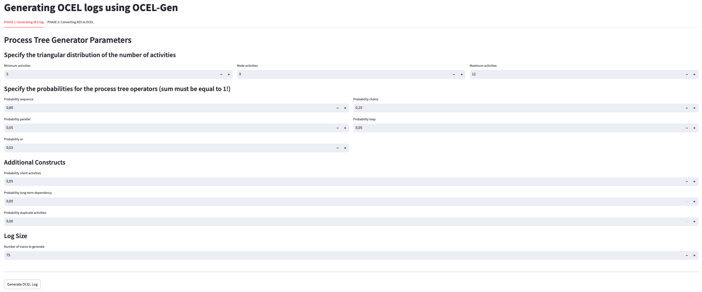
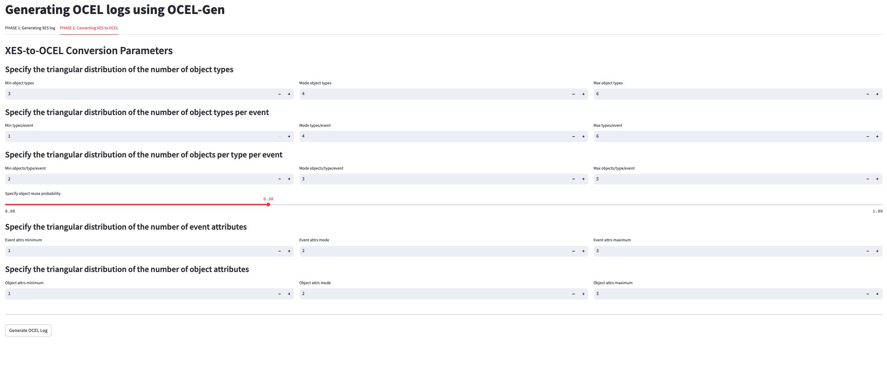

**O**bject-**C**entric **E**vent **L**og **Gen**erator for creating synthetic OCEL logs for benchmarking object-centric process mining methods.

This repository contains the implementation of **OCEL-Gen**, an interactive Python-based tool for generating synthetic event logs in the OCEL 1.0 format. The tool enables configurable generation of process control-flow structures and object interactions, supporting controlled benchmarking of object-centric process mining algorithms.

---

## Table of Contents

- [ Interactive Web Application](#interactive-web-application)
- [ Requirements](#requirements)
- [ Installation](#installation)
- [ General Usage](#general-usage)
- [ Visualization](#visualization)


---

## Interactive Web Application

Use the [Streamlit-based GUI](https://streamlit.io) to configure and generate logs in just a few clicks:

```bash
streamlit run app.py
```

You can:
- Configure process tree structure (control-flow complexity)
- Configure number of object types, reuse probability, and event/object attributes
- Generate and download OCEL logs directly
- Export the configuration used

---

## Requirements

- Python ≥ 3.9  
- [Graphviz](https://graphviz.org/download/) installed in the system  
- Required packages in `requirements.txt`:
  - `streamlit`
  - `pandas`, `numpy`
  - `matplotlib`, `seaborn`
  - `pm4py`
  - `scipy`

---

## Installation

```bash
git clone https://github.com/sabrinehaddad/ocelgen.git
cd ocel-gen
pip install -r requirements.txt
```

---

## General Usage

### Run OCEL-Gen via GUI

```bash
streamlit run app.py
```
###  Phase 1: Configure Process Tree Parameters


###  Phase 2: Configure XES-to-OCEL Conversion Parameters



### Example CLI usage

```bash
python main.py --config config.json
```

### Outputs:
- OCEL Log: `synthetic_logs/ocel/log.jsonocel`
- Configuration: Downloadable as JSON via the GUI

### Visualizations:
#### [Fig.  7.1, fig. 7.2 and fig. 7.3 Representativeness](notebooks/representativeness.ipynb)
This notebook provides a visual comparison between real-world and synthetic OCEL logs. It includes:

PCA Projection with Convex Hulls: Highlights coverage of the feature space via 2D projections.

Feature Distribution Strip Plots: Compares individual normalized features across both sets.

KL Divergence and Coverage Score: Quantifies similarity between real and synthetic logs, offering a numerical assessment of representativeness.


#### [Fig.  7.4 Representativeness](notebooks/runtime.ipynb)
This notebook visualizes the runtime performance trends of the OCEL-Gen generator. It evaluates:

XES and OCEL generation time across five parameter variations:

- Number of Traces

- Activity Mode

- Object Reuse Probability

- Number of Object Types

- Object Types per Event
```bibtex
@misc{ocelgen2025,
  title     = {OCEL-Gen: A Parameterizable Generator for Object-Centric Event Logs},
  author    = {Sabrine Haddad},
  year      = {2025},
  note      = {Tool available at https://github.com/sabrinehaddad/ocelgen}
}
```

---

## Contact

For issues, suggestions, or collaborations, please reach out via GitHub Issues or contact [sabrine.haddad@campus.lmu.de].
